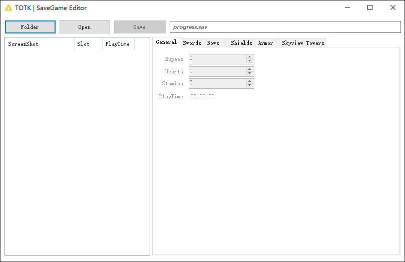

# The Legend of Zelda: Tears of the Kingdom | Savegame Editor | Plus

## Preview

**Make sure to backup your save before using the savegame editor**

If you get an error upon launching, install [.NET Framework 4.8](https://dotnet.microsoft.com/en-us/download/dotnet-framework/net48).

Item names are stolen from [marcrobledo](https://github.com/marcrobledo/savegame-editors/tree/master/zelda-totk).

Check out his [TOTK SaveEditor](https://www.marcrobledo.com/savegame-editors/zelda-totk/) (it's better than this one)

## Plus version Features:

* Add save folder select

* Add save screenshot preview

* Add save playtime display

## Features:

- Rupees
- Max Hearts
- Stamina
- Map
- Swords
- Bows
- Arrows
- Shields
- Armor
- Towers

## Usage

- **Backup your save**
- Click on `Folder` to select savefile folder
- Select your `Screenshot` in the left list
- Click on `Open` to open current savefile
- Edit the values to your desired amounts
- Click on `Save` to save

**A quick note on stamina:**

- 1000 = 1 Wheel
- 2000 = 2 Wheels
- 3000 = 3 Wheels

You can go above 3 wheels but they dont show in game
